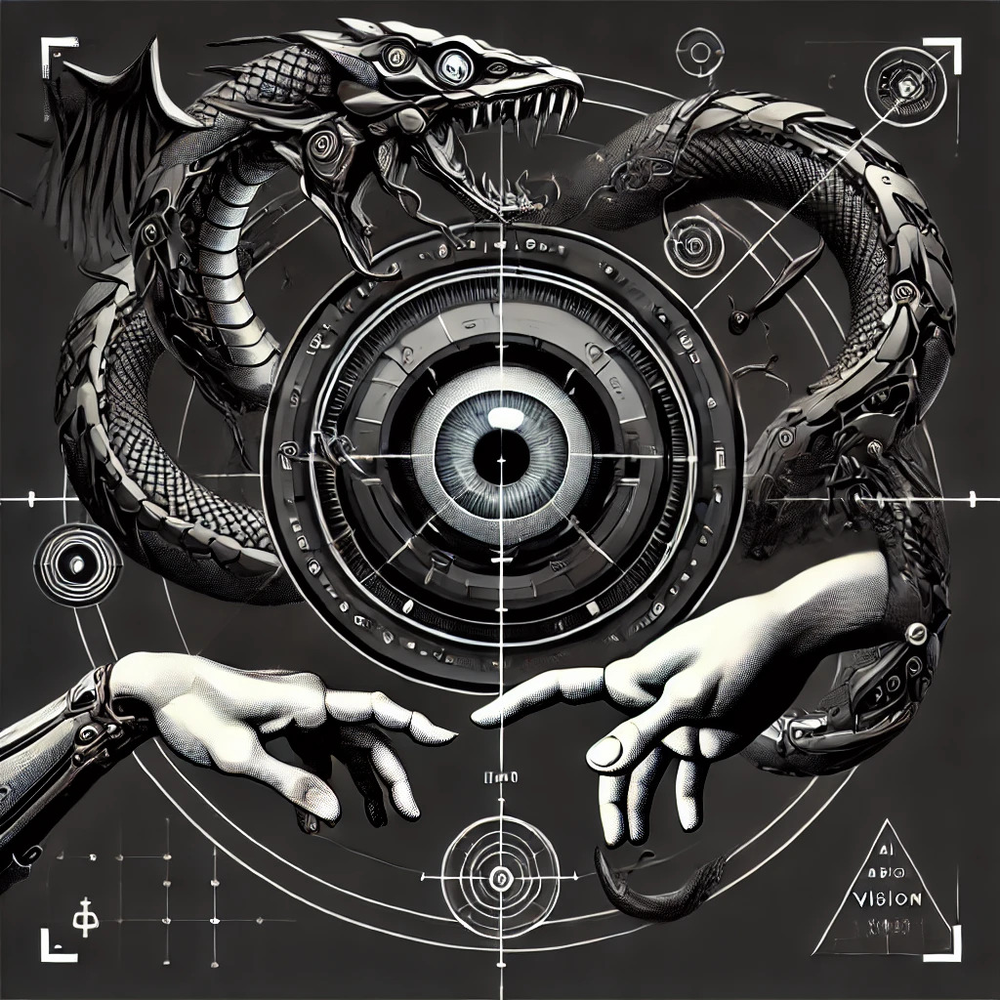

# DeepSight Studio

  

  <em>A comprehensive computer vision platform for training and deploying YOLO object detection models</em>

  <a href="#installation">Installation</a> •
  <a href="#features">Features</a> •
  <a href="#components">Components</a> •
  <a href="#workflow">Workflow</a> •
  <a href="#development">Development</a> •
  <a href="#troubleshooting">Troubleshooting</a>

---

## 🚀 Installation 

### Quick Installation (Windows)

1. Clone this repository:
   git clone https://github.com/VoidReturn0/DeepSightStudio.git
   
CD into github folder

Run the installer script as Administrator:

bashCopyDeepSightStudio_Installer.bat

The installer will:

✅ Check for and install Python 3.8+ if needed
✅ Create a virtual environment
✅ Install all required dependencies
✅ Clone YOLOv5 and YOLOv8 repositories
✅ Download pre-trained model weights
✅ Install the Orbitron font
✅ Set up the proper directory structure
✅ Create a desktop shortcut

Launch DeepSight Studio:

Use the desktop shortcut, or
Run launch_deepsight.bat

Manual Installation

Click to expand manual installation steps

Ensure Python 3.8+ is installed
Create and activate a virtual environment:
bashCopypython -m venv venv
venv\Scripts\activate  # On Windows
source venv/bin/activate  # On Linux/Mac

Install dependencies:
bashCopypip install -r requirements.txt

Clone YOLOv5 repository:
bashCopygit clone https://github.com/ultralytics/yolov5.git

Download the Orbitron font from Google Fonts and install it
Create a maintenance.json file with default settings
Run the application:
bashCopypython gui.py

✨ Features 
DeepSight Studio is an integrated computer vision application framework designed for training and deploying object detection models, particularly focused on YOLOv5 and YOLOv8. The application provides a complete workflow from image acquisition to model training and testing.

📷 Image Acquisition: Capture, crop, and augment training images from camera feeds
🏷️ Data Labeling: Automated and manual annotation tools using edge detection and YOLO models
🎮 Hardware Control: Serial communication with control systems for automated image capture
🧠 Model Training: Integrated YOLOv5/YOLOv8 training with parameter tuning
⚙️ Configuration Management: Centralized settings stored in JSON format
🌙 Dark Mode Interface: Modern UI design with custom font support

🧩 Components 
Main GUI (gui.py)

The main DeepSight Studio interface that serves as the entry point to all modules.

Key Classes:

DeepSightStudio: Main application window that provides access to all modules
MaintenanceSettings: Configuration management window for all settings
VisionSettingsWindow: Camera and resolution configuration
LabelingSettingsWindow: Canny edge detection parameter configuration
HardwareSettingsWindow: Serial port and baud rate configuration
TrainingSettingsWindow: YOLO model and training parameter configuration

Key Functions:

load_custom_font(): Loads the Orbitron font at runtime on Windows
load_maintenance_config(): Loads settings from the maintenance.json file
create_widgets(): Creates the main UI elements in each window class
save_to_json(): Saves configuration updates to the maintenance.json file

Image Acquisition (image_acquisition.py)

Module for capturing and augmenting training images from a camera feed.

Key Classes:

TrainingApp: Main class for image acquisition with camera feed display

Key Functions:

random_variation(): Applies random brightness and contrast adjustments
apply_hsv_adjustment(): Modifies hue and saturation values
apply_translation(): Shifts images along x and y axes
apply_shear(): Applies shearing transformations
apply_flip(): Performs horizontal flipping with a given probability
apply_zoom_centered(): Implements centered zooming operations
apply_random_rotation(): Rotates images by a random angle
create_folder_structure(): Creates organized directories for training data
update_raw_feed(): Updates the camera feed display in real-time
training_capture_loop(): Captures and augments images in a continuous process

Data Labeling (image_labeling.py)

Tool for annotating images for YOLO training with automated detection.

Key Classes:

ImageLabelingApp: Main image labeling application with annotation tools

Key Functions:

load_yolo_model(): Loads YOLOv5 or YOLOv8 models for auto-labeling
compute_yolo_bbox(): Calculates bounding boxes from edge detection results
compute_padded_bbox(): Adds padding to bounding boxes and normalizes coordinates
update_yaml_file(): Updates data configuration for training
analyze_roi(): Performs edge detection on selected regions of interest
auto_label_folder(): Batch processes images with edge detection
auto_label_with_yolo(): Uses YOLO models for automatic image labeling
save_domino_edge_data(): Exports labeled data in YOLO format

Training Hardware (training_hardware.py)

Interface for controlling hardware via serial communications.

Key Classes:

TrainingHardwareController: Main hardware control interface

Key Functions:

on_move_positive(), on_move_negative(): Controls positive/negative axis movements
move_axis(): Sends movement commands with proper axis inversion
start_jog(), do_jog(), stop_jog(): Implements continuous motion controls
home_axes(): Sends homing commands to the hardware
test_connection(): Tests and establishes serial communication
send_gcode(): Sends G-code/M-code commands to the hardware
update_endstop_signals(): Updates the UI with current endstop states

Training Session (training_session.py)

Interface for configuring and launching YOLO training.

Key Classes:

TrainingSessionPage: Main training configuration and execution interface
TestTrainingWindow: Inference testing interface for trained models

Key Functions:

start_training(): Initiates the training process with selected parameters
update_last_metrics(): Updates the UI with metrics from the latest training run
run_autotune(): Performs hyperparameter optimization experiments
run_inference(): Executes inference on test images using trained models

Configuration System
DeepSight Studio uses a central maintenance.json configuration file to store settings for all modules. This includes:

Camera settings (device index, resolution)
Labeling parameters (Canny thresholds)
Training settings (model type, weights path, batch size, etc.)
Hardware settings (COM port, baud rate)
Global UI settings (window dimensions)

📋 Workflow 
1. Image Acquisition

Open "Vision Acquisition" from the main menu
Configure camera settings if needed
Click and drag to select a Region of Interest (ROI)
Adjust augmentation parameters
Click "Train" to start capturing augmented images
Images are saved to the training_data directory

2. Data Labeling

Open "Data Labeling" from the main menu
Select the folder with your training images
Set the appropriate label for objects in the images
Use "Auto Label with YOLO" for pre-trained model detection
Use "Analyze ROI" for edge detection-based labeling
Save labeled images to prepare for training

3. Training

Open "Training Session" from the main menu
Select model type and weights
Configure batch size, image size, and epochs
Select data configuration file
Click "Start Training" to begin the process
Monitor training progress in the output window
View metrics after training completes

4. Testing

From the Training Session window, click "Test Training"
Navigate through your training images
Observe detection results with the trained model
Adjust parameters and retrain if necessary

🛠️ Development 
Adding New Features

Each module is designed to be extended with additional functionality
New augmentation methods can be added to image_acquisition.py
Additional detection algorithms can be integrated in image_labeling.py
Support for different hardware can be added in training_hardware.py

Training Custom Objects

Create a new category in the image acquisition module
Capture and label at least 100 images for good performance
Configure training parameters appropriate for your dataset
Train the model and test on new images

❓ Troubleshooting 
Common Issues

Camera not found: Ensure your camera is properly connected and not in use by another application
YOLO model errors: Check that the YOLOv5 repository was properly cloned
Font display issues: Make sure the Orbitron font is installed
Serial communication problems: Verify COM port settings and hardware connections

Getting Help
If you encounter problems not covered in this documentation, please open an issue in the GitHub repository.
